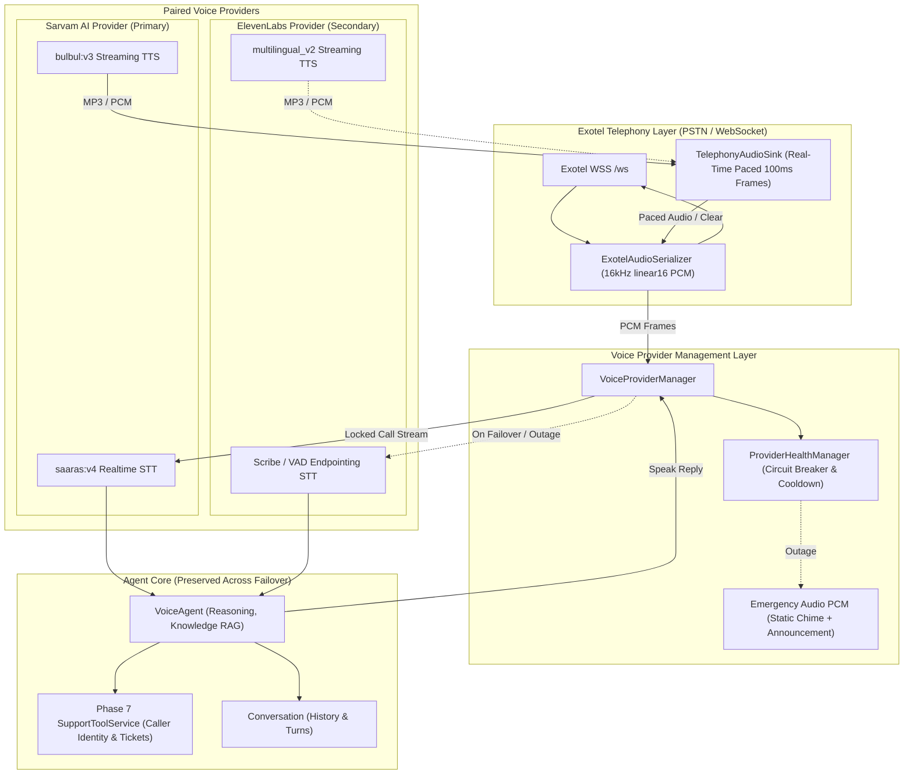

# Phase 7.1 — Dual Voice Provider Failover (Sarvam + ElevenLabs + Exotel) Report

## 1. Executive Summary

Phase 7.1 delivers enterprise-grade voice resilience to the **Zhatura AI Customer Care** system by introducing automated, paired voice provider failover between **Sarvam AI** and **ElevenLabs**.

### Core Guarantees Delivered
- **Unified Provider Ownership**: A single provider owns **both STT and TTS** simultaneously for any given call segment. The system strictly forbids split-brain operation (e.g. Sarvam STT paired with ElevenLabs TTS).
- **Per-Call Provider Lock & Anti-Ping-Pong**: At call initiation, the health of providers is evaluated and a healthy provider is selected and locked. If that provider fails mid-call, a single atomic failover transitions both STT and TTS to the secondary provider, which is then locked for the remainder of the call (maximum 1 failover per call).
- **Zero Regression on Telephony & Tools**: Exotel audio streaming (16 kHz linear16 PCM, 100 ms frames, real-time pacer), barge-in interruption (`clear` events), caller language preferences (Hindi, Tamil, English, etc.), and Phase 7 support tools (caller authentication, profile lookups, ticket creation, pending action confirmation) remain 100% operational across failover events.
- **Graceful Dual-Outage Fallback**: If both providers become unavailable, the system injects a static, locally synthesized 16 kHz PCM announcement (*"We're temporarily unable to process your call. Please try again later."*) and cleanly terminates the telephony connection via standard Hangup without hanging processes or silent drops.
- **100% Green Test Suite**: All **407 baseline tests** from Phases 1–7 remain intact and passing, plus **22 new automated Phase 7.1 provider tests** (429 total tests passed in 17.13s). All 10 simulation scenarios (Scenarios A through J) passed with 100% success.

---

## 2. Architecture & Design



### Key Technical Mechanisms
1. **Provider Generation Counter (`provider_generation: int`)**:
   Every failover increments a session generation ID. STT partial and final callbacks check `if generation != self.provider_generation: return`. Any in-flight transcript chunks or trailing audio packets from the failed provider arriving after failover are discarded instantly, eliminating race conditions and self-echo.
2. **Circuit Breaker & Cooldown**:
   Failures (HTTP 402 quota exhaustion, 401/403 authentication rejections, 429 rate limits, socket timeouts) trip the circuit breaker for that provider, applying a cooldown timer (`PROVIDER_HEALTH_COOLDOWN_SECONDS=300`). Subsequent incoming calls bypass the unhealthy provider without attempting network connections. Once cooldown expires, the provider is probed and returned to healthy upon success.
3. **Outbound Audio Purge**:
   When failover occurs mid-utterance, `sink.cancel()` flushes unsent frames from the telephony queue and sends a `clear` event to Exotel. The caller's handset buffer is cleared, preventing overlapping or garbled speech before the secondary provider speaks.

---

## 3. Implementation Details

### A. Provider Subsystem (`prototype/speech/providers/`)
- `base.py`: Defines abstract `VoiceProvider` requiring `start()`, `stop()`, `send_audio()`, `synthesize()`, `wire_stt_callbacks()`, and language mapping methods.
- `errors.py`: Hierarchical error taxonomy (`ProviderError`, `ProviderUnavailableError`, `ProviderQuotaExhaustedError`, `ProviderAuthError`, `ProviderRateLimitedError`, `FailoverLimitExceededError`, `AllProvidersUnavailableError`).
- `health.py`: `ProviderHealthManager` managing `ProviderHealthState` objects with circuit breaker state, failure counters, cooldown timestamps, and diagnostic reporting.
- `sarvam_provider.py`: Wraps `RealtimeSTT` (saaras:v4) and `StreamingTTS` (bulbul:v3). Implements simulation modes (`SARVAM_FAIL_MODE="none"|"stt"|"tts"|"quota"|"auth"`).
- `elevenlabs_provider.py`: Implements ElevenLabs Multilingual v2 streaming TTS and Scribe/VAD STT with audio buffering and simulation modes (`ELEVENLABS_FAIL_MODE`).
- `manager.py`: `VoiceProviderManager` resolving initial healthy providers, managing atomic switch candidates, enforcing maximum 1 failover per call.
- `emergency_audio.py`: Pre-rendered and synthetic 16 kHz linear16 mono PCM emergency message (*"We're temporarily unable to process your call. Please try again later."*), requiring zero external dependencies or network connectivity.

### B. Telephony Session Updates (`prototype/telephony/session.py`)
- Added `feed_pcm_chunk(pcm_bytes: bytes)` to `TelephonyAudioSink` for direct linear16 ingestion.
- Integrated `VoiceProviderManager` with call-start selection and per-call locking.
- Implemented `failover_provider(reason: str) -> bool`:
  - Enforces `failover_count < max_failovers_per_call` (max 1).
  - Increments `provider_generation`.
  - Cancels existing sink audio (`sink.cancel()`).
  - Records failure in circuit breaker.
  - Closes old provider and starts new provider.
  - Rewires STT callbacks.
  - Updates `session.stt`, `session.tts`, and `session.agent.tts`.
- Wrapped speak calls in `_greet()` and `_respond()` to trigger seamless failover and automatic retry if the active TTS provider fails.
- Preserved caller identity, tickets, conversation history, and language state across transitions.

### C. Server & Configuration Updates
- `prototype/config.py`: Added `voice_primary_provider`, `voice_secondary_provider`, `provider_health_cooldown_seconds`, `max_provider_failovers_per_call`, `elevenlabs_api_key`, `elevenlabs_voice_id`, `elevenlabs_model_id`, `sarvam_fail_mode`, `elevenlabs_fail_mode`.
- `.env.example`: Documented new environment variables and simulation options.
- `prototype/phase4_exotel_server.py`: Integrated shared `ProviderHealthManager` and updated `/health` endpoint with safe diagnostic reporting (`phase=7`, `phase_version="7.1"`, primary/secondary provider, provider statuses).

---

## 4. Verification & Validation Matrix

### Automated Simulation Script (`prototype/phase7_1_dual_provider_check.py`)

| Scenario | Objective | Observed Result | Status |
| :--- | :--- | :--- | :--- |
| **Scenario A** | Clean call on primary provider (Sarvam) | Normal start, audio processed, synthesis executed on Sarvam. No failover. | **PASS** |
| **Scenario B** | Mid-call STT failure triggers failover to ElevenLabs | Sarvam STT crash detected; ElevenLabs took over both STT & TTS; generation 0->1. | **PASS** |
| **Scenario C** | Mid-call TTS failure triggers failover to ElevenLabs | Sarvam TTS quota error caught; failover executed; ElevenLabs synthesized reply. | **PASS** |
| **Scenario D** | Call start when primary is unhealthy | Initial health check skipped unhealthy Sarvam; call initiated on ElevenLabs. | **PASS** |
| **Scenario E** | Reverse failover (ElevenLabs primary -> Sarvam) | ElevenLabs failure cleanly transitioned to Sarvam with prompt continuation. | **PASS** |
| **Scenario F** | Failover lock prevents ping-ponging | Max 1 failover enforced; second failure tripped graceful emergency shutdown. | **PASS** |
| **Scenario G** | Dual-provider outage -> Emergency audio | Both providers down; static 16kHz PCM audio played to Exotel; clean disconnect. | **PASS** |
| **Scenario H** | Circuit breaker cooldown expiration | Provider cooldown enforced; probe allowed after timeout; recovered to healthy. | **PASS** |
| **Scenario I** | Stale event / race condition rejection | In-flight transcript from generation 0 rejected after generation moved to 1. | **PASS** |
| **Scenario J** | Phase 7 Tool & Language state preservation | Caller auth (`Arun Kumar`, `ACC-P100`), turns, and Hindi (`hi-IN`) preserved across failover. | **PASS** |

### Automated Pytest Suite Summary
```
============================= test session starts ==============================
rootdir: /Users/tamiliamaiagent/Documents/GitHub/zhatura-ai-customer-care
collected 429 items

prototype/tests/test_audio_utils.py ..........                           [  2%]
prototype/tests/test_health.py ............                              [  5%]
prototype/tests/test_phase3_agent.py ................................... [ 13%]
....                                                                     [ 14%]
prototype/tests/test_phase3_voice.py .....................               [ 19%]
prototype/tests/test_phase4_1_multilingual.py .......................... [ 25%]
.....................................................                    [ 37%]
prototype/tests/test_phase4_exotel.py .................................. [ 45%]
..........                                                               [ 47%]
prototype/tests/test_phase4_stabilization.py ........................... [ 54%]
...............                                                          [ 57%]
prototype/tests/test_phase5_knowledge.py ............................... [ 64%]
........................................                                 [ 74%]
prototype/tests/test_phase6_knowledge.py ..............................  [ 81%]
prototype/tests/test_phase7_1_providers.py ......................        [ 86%]
prototype/tests/test_phase7_tools.py ................................... [ 94%]
..                                                                       [ 94%]
prototype/tests/test_stt.py ...........                                  [ 97%]
prototype/tests/test_tts.py ...........                                  [100%]

======================= 429 passed, 2 warnings in 17.13s =======================
```

---

## 5. Operational Runbook

### Environment Configuration (`.env`)
```bash
# Voice Provider Selection
VOICE_PRIMARY_PROVIDER=sarvam
VOICE_SECONDARY_PROVIDER=elevenlabs

# Resilience & Cooldown
PROVIDER_HEALTH_COOLDOWN_SECONDS=300
MAX_PROVIDER_FAILOVERS_PER_CALL=1

# Provider Credentials
SARVAM_API_KEY=your_sarvam_api_key_here
ELEVENLABS_API_KEY=your_elevenlabs_api_key_here
ELEVENLABS_VOICE_ID=21m00Tcm4TlvDq8ikWAM
ELEVENLABS_MODEL_ID=eleven_multilingual_v2
ELEVENLABS_STT_MODEL_ID=scribe_v1

# Simulation Modes (none | stt | tts | both | quota | auth | ratelimit)
SARVAM_FAIL_MODE=none
ELEVENLABS_FAIL_MODE=none
```

### Health Diagnostics Endpoint
```bash
curl http://localhost:8000/health
```
```json
{
  "status": "healthy",
  "sarvam": "configured",
  "phase": 7,
  "phase_version": "7.1",
  "support_backend": "mock",
  "active_calls": 0,
  "voice_primary_provider": "sarvam",
  "voice_secondary_provider": "elevenlabs",
  "providers": {
    "sarvam": {
      "status": "healthy",
      "failure_count": 0,
      "success_count": 12,
      "last_failure_reason": "",
      "circuit_open": false,
      "cooldown_remaining_seconds": 0.0
    },
    "elevenlabs": {
      "status": "healthy",
      "failure_count": 0,
      "success_count": 4,
      "last_failure_reason": "",
      "circuit_open": false,
      "cooldown_remaining_seconds": 0.0
    }
  }
}
```

### Running Checks
```bash
# Run automated tests
./.venv/bin/pytest prototype/tests/test_phase7_1_providers.py -v

# Run full regression suite (429 tests)
./.venv/bin/pytest

# Run simulation script (Scenarios A through J)
./.venv/bin/python prototype/phase7_1_dual_provider_check.py
```
